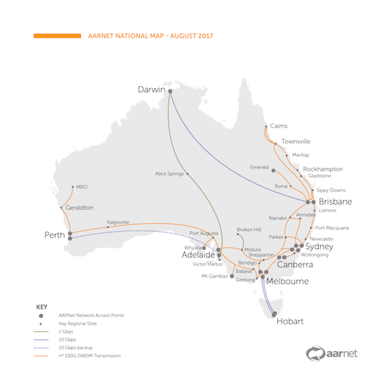

@title[Network Literacy]
# Network Literacy

Data movement and network know-how

A train the trainer workshop
 

Note:
Network literacy is useful for research data managers and researchers. 

---
@title{Network Features]
### Network features

- Point 1
- Point 2
- Point 3

---
@title[National Network]
### National network 

---
@title[International Network]
### International network

