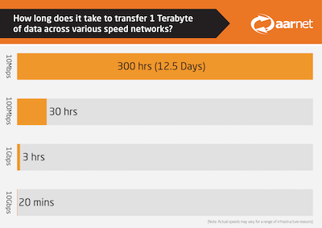
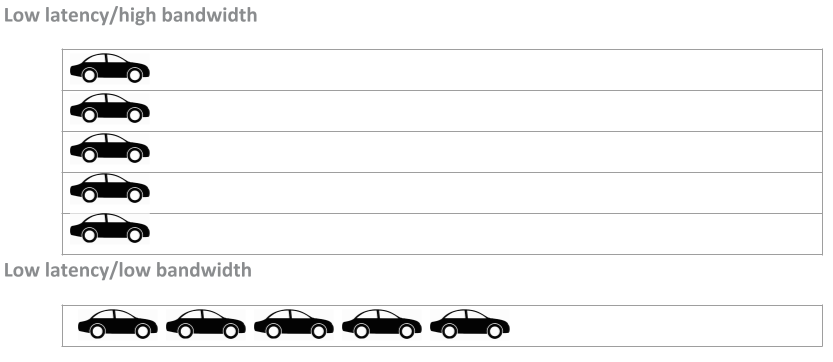
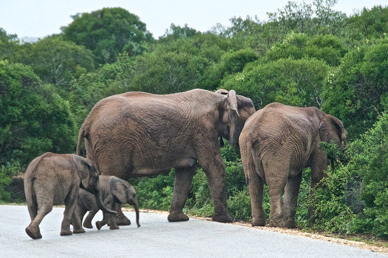
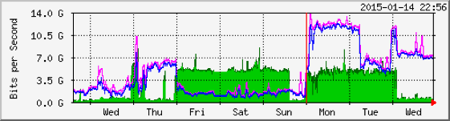

@title[Network Literacy]
## Network Literacy

Data movement and network know-how

A train the trainer workshop
 

Note:
Network literacy is useful for research data managers and researchers handling and moving data either large single files or many many files in the GB-PB scale. Time spent testing network speeds and calculating transfer times aids to determine whether tools and methods for data upload and transfer are fit-for-purpose.    

---
@title[Talking Points]
### Talking Points
- Advanced research networks
- Global NREN* network
- Network features

\*NREN = national research and education network 
 

Note:
AARNet is Australia's national research and education network, or NREN.  AARNet's advanced research network infrastructure interconnects Australian institutions and organisations involved in research and education with the global research and education network community and resources across multiple 10, 40 and 100 gigabit per second (Gbps) links.  

---
@title[Exercises]
### Hands On Exercises

- Speedtest &#128640;
- Ping &#128266;
- Trace route &#128270;
- Transfer bingo &#129299;

---
@title[Speed Test]
### Speed Test &#128640;

- Tool: http://www.speedtest.net/   
- Test on: wifi and a mobile phone  
- Pay attention to: upload vs download speeds 

Note:
Speed - bandwidth and latency are important factors (i.e. the amount of data that can be received every second).  

---
@title[Australian NREN]
### Australian NREN

- Advanced research network infrastructure
- Fast - 10 Gbps > 40 Gbps > 100 Gbps
- High capacity - 1 million + users 
- Tailored for research, teaching and learning 
- Low latency - consistent connectivity and response time

---

@title[NBN]
### NBN
<table>
  <tr>
  <th>Network</th>
  <th>Download</th>
  <th>Upload</th>
  </tr>
<tr>
    <td>NBN</td>
    <td>100 Mbps</td>
    <td>40 Mbps</td>
  </tr> 
<tr class="fragment">
    <td>NBN</td>
    <td>1 Gbps</td>
    <td>400 Mbps</td>
  </tr>
 </table>

See <a href="https://www.nbnco.com.au/content/dam/nbnco2/documents/nbn-business-fact-sheets/nbn-business-fact-sheet-tc4.pdf">NBN Fact Sheet: Traffic Class 4 for data</a> 

Note:
The download and upload speeds of the domestic broadband speeds factor more download than upload.   

---
@title[NREN]
### NREN
<table>
  <tr>
  <th>Network</th>
  <th>Download</th>
  <th>Upload</th>
  </tr>
<tr>
    <td>NREN</td>
    <td>10 Gbps</td>
    <td>10 Gbps</td>
  </tr> 
<tr class="fragment">
    <td>NREN</td>
    <td>40 Gbps</td>
    <td>40 Gbps</td>
  </tr>
<tr class="fragment">
    <td>NREN</td>
    <td>100 Gbps</td>
    <td>100 Gbps</td>
  </tr>
 </table>

Note:
The download and upload speeds of the advanced research network are the same and the speeds are significantly greater.   

---
@title[1TB Transfer]
### 1TB Transfer

See Tech of the Internets <a href="https://techinternets.com/copy_calc">File Transfer Time Calculator</a> 

Note:
Time can be saved if the network speeds are tested ahead of trying to transfer data, network traffic levels are known, and file sizes have been calculated.  For example: I have 20TB data to transfer on a 40Gbps link.  How long will it take to transfer that data?  Answer: Speed: 40 Gbps, Size: 20 TB, Time: 1 Hours, 15 Minutes and 05 Seconds.   

---
@title[National Network]
### National network 

Note: 
Australia is a large continent, and the networks AARNet provides enable data capture and research to be conducted in major cities and in regional areas, where universities and research facilities and infrastructure are located, e.g. the National Computational Infrastructure (NCI) in Canberra and the Square Kilometre Array (SKA) in Murchison (WA).   

---
@title[International Network]
### International network

Note:
Australia lies at a distance from research conducted in other parts of the world, like the northern hemisphere, and the networks AARNet provides, aid in removing distance as a barrier, to research collaboration.  

---
@title[Network Features - Physical]
### Network features

Physical

- Different topologies e.g. spurs, rings, stars   
- Different speeds e.g. Mbps or Gbps links    
- Affected by interference e.g. microwaves, lift motors, air-conditioning fans
- Comprised of cables or wireless media

---
@title[Network Features - Management]
### Network features

Management

- Dedicated e.g. science DMZ or shared e.g. enterprise
- Manage different scales of data e.g. moving large files (TB or PB scale) or many files (2 or 200,000)
- Traffic on networks can be restricted inside or outside (via firewall)  

Note:
Think of wifi like rope where you unwind it and hand out each strand (as users log in).  The more uses, the less and less rope there is to hand out.  Many laptops link to an access point on the network (the wifi) and that access point divides up the traffic to each laptop user.   

---
@title[100MB Speed Tests]
### 100MB Speed Test

- 7 minutes | 3.38 Mbps (at home on poor ADSL)
- 17 seconds | 54 Mbps (at a conference on wifi) 
- 8 seconds | 100 Mbps (on the NBN)
- microseconds | 10 Gbps (on the NREN) 

100MB is above the attachment size limits on most email services.
 

Note:
100MB is larger than the size of files that can be attached to a gmail message (size limit of 25MB for emails sent and 50MB for emails received).  See Google Update: https://gsuiteupdates.googleblog.com/2017/03/receive-emails-of-up-to-50mb-in-gmail.html   

--- 
@title[100TB Speed Tests]
### 100TB Speed Test

- 4973 days | 3.38 Mbps (at home on poor ADSL)
- 199 days | 54 Mbps (at a conference on wifi) 
- 101 days | 100 Mbps (on the NBN)
- 1 day | 10 Gbps (on the NREN) 
- 46 minutes | 40 Gbps (on the NREN) 
- 18 minutes | 100 Gbps (on the NREN)

Research data collections are growing into the multi terabye and petabyte scale.
     

Note:
<a href="https://news.aarnet.edu.au/aarnet-delivers-400gbps-for-high-tech-networking-demo-fest/">“Elephant flows”</a>, the multi-gigabit flows of data generated by data-intensive research fields, are carried globally across research network infrastructure, avoiding the contention and congestion of the commercial internet.

---
@title[Data Collection Size]
### Data Collection Size 

- 90 data collections = 2200TB (average = 24TB)
- 49 data collections = 359TB (average = 7TB)
- 31 data collections = 2237TB (average = 72TB) 

See <a href="https://www.rds.edu.au/research-communities">Research Community Projects</a>

Note: 
The Research Data Services program funded storage for domain specific data collections, examples here are: medical and health, cultures and community, and life sciences (genomics) respectively.  The sizes of the data collections vary, however these calculations emphasise what sort of network speed is needed to move a data collection let alone build a library of data collections. 

---
@title[Bandwidth]
### Bandwidth

Network **bandwidth** tests generally measure the maximum **throughput** (of data that can be processed).   
 

Network throughput is: measured in bits per second (bps) and calculated by dividing the file size.
 

Note:
Network throughput is measured in bits per second (bps) of successful data processing (message delivery/file transfer) across the network.  Throughput is calculated by dividing the file size (1 byte = 8 bits) by the time (seconds) it takes to get the file between two points on the network.   

---
@title[Low Latency]
### Latency
 

Note: 
See explanation of <a href="http://www.plugthingsin.com/internet/speed/latency/">latency</a>.  5 cars will get from point A to point B faster if they’re on a 5 lane freeway (low latency, high bandwidth) compared to the same number of cars making the same trip down a 1 lane freeway (low latency, small bandwidth).  

---
@title[Elephants]
### Elephants

<a href="https://www.flickr.com/photos/birdbrian/33907040906/">CC-BY 2.0 Brian Ralphs</a>

---
@title[Elephant Flows]
### Elephant Flows

Spot the large blocks of traffic (elephants) moving in and out of the network. 

Note:
Elephants (in green) can be seen out through Friday to Sunday, and on Monday and Tuesday across the network.  Elephants (in pink/purple lines) can be seen moving in on Thursday, Monday and Wednesday.  The NREN has been purpose built to support "bursting" to support "elephant flows".  

---
@title[Science DMZ]
### Science DMZ
A scientific network:  
- Optimised for big data science 
- Improves overall network performance 

Note:
Campus network architecture is not designed for large data flows.  Science data transfer applications have unique network requirements that increasingly can’t be met by networks that are optimized for normal business operations like web browsing and business systems.  Big data science may require data moved between institutions and research facilities that are geographically distributed. 

---
@title[Network Architecture]
### Network Architecture

Note:
Science DMZ architecture separates science traffic from general purpose traffic, diverting large flows of data around the institutional firewall. Implementing science DMZ (demilitarised zone) improves network performance for big data science - and - regular users of the campus network.  

---
@title[Transfer Bingo]
### Transfer Bingo &#128640;

<a href="https://support.aarnet.edu.au/hc/en-us/articles/226678987-Data-Rates">Science DMZ data rates</a>

Note:
Science DMZ data rates: the table shows the bandwidth required to transfer data sizes for allotted time frames. The base data is sourced from ESnet and recalculated. What data rates are needed? Q: If you want to send 100MB in 5 minutes? A: 2.67 Mbps.  Q: If you want to send 100TB overnight? A: 27.78 Gbps.  Q: If you want to send 100TB in an hour?  A: 222.22 Gbps.     
