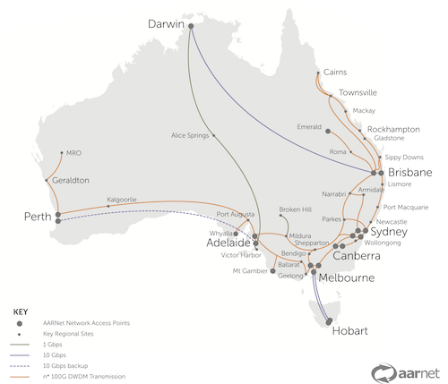

@title[Network Literacy]
## Network Literacy

Data movement and network know-how

A train the trainer workshop
 

Note:
Network literacy is useful for research data managers and researchers handling and moving data either large single files or many many files in the GB-PB scale. Time spent testing network speeds and calculating transfer times aids to determine whether tools and methods for data upload and transfer are fit-for-purpose.    

---
@title[Talking Points]
### Talking Points
- Advanced research networks
- Global NREN* network
- Network features

\*NREN = national research and education network 
 

Note:
AARNet is Australia's national research and education network, or NREN.  AARNet's advanced research network infrastructure interconnects Australian institutions and organisations involved in research and education with the global research and education network community and resources across multiple 10, 40 and 100 gigabit per second (Gbps) links.  

---
@title[Exercises]
### Hands On Exercises

- Speedtest
- Ping
- Trace route
- Transfer bingo

---
@title[Australian NREN]
### Australian NREN

- Advanced research network infrastructure
- Fast - 10 Gbps > 40 Gbps > 100 Gbps
- High capacity - 1 million + users 
- Tailored for research, teaching and learning 
- Low latency - consistent connectivity and response time

---
@title[NREN v NBN]
### NREN v NBN
<table>
  <tr>
  <th>Network</th>
  <th>Download</th>
  <th>Upload</th>
  <tr>
    <td>NREN</td>
    <td>100 Gbps</td>
    <td>100 Gbps</td>    
  </tr>
  <tr> 
    <td>NREN</td>
    <td>40 Gbps</td>
    <td>40 Gbps</td>    
  </tr>
  <tr>
    <td>NREN</td>
    <td>10 Gbps</td>
    <td>10 Gbps</td>    
  </tr>
   <tr>
    <td>NBN</td>
    <td>1 Gbps</td>
    <td>400 Mbps</td>
  </tr>
 <tr>
    <td>NBN</td>
    <td>100 Mbps</td>
    <td>40 Mbps</td>
  </tr>  
</table>

See <a href="https://www.nbnco.com.au/content/dam/nbnco2/documents/nbn-business-fact-sheets/nbn-business-fact-sheet-tc4.pdf">NBN Fact Sheet: Traffic Class 4 for data</a> 

Note:
Note that the download and upload speeds of the advanced research network are the same, whereas domestic broadband speeds factor more download than upload.   

---
@title[1TB Transfer]
### 1TB Transfer

---
@title[National Network]
### National network 

Note: 
Australia is a large continent, and the networks AARNet provides enable data capture and research to be conducted in major cities and in regional areas, where universities and research facilities and infrastructure are located, e.g. the National Computational Infrastructure (NCI) in Canberra and the Square Kilometre Array (SKA) in Murchison (WA).   

---
@title[International Network]
### International network

Note:
Australia lies at a distance from research conducted in other parts of the world, like the northern hemisphere, and the networks AARNet provides, aid in removing distance as a barrier, to research collaboration.  

---
@title[Network Features - Physical]
### Network features
#### Physical

- Different topologies e.g. spurs, rings, stars   
- Different speeds e.g. Mbps or Gbps links    
- Affected by interference e.g. microwaves, lift motors, air-conditioning fans
- Comprised of cables or wireless media

---
@title[Network Features - Management]
### Network features
#### Management

- Dedicated e.g. science DMZ or shared e.g. enterprise
- Manage different scales of data e.g. moving large files (TB or PB scale) or many files (2 or 200,000)
- Traffic on networks can be restricted inside or outside (via firewall)  

Note:
Think of wifi like rope where you unwind it and hand out each strand (as users log in).  The more uses, the less and less rope there is to hand out.  Many laptops link to an access point on the network (the wifi) and that access point divides up the traffic to each laptop user.   

